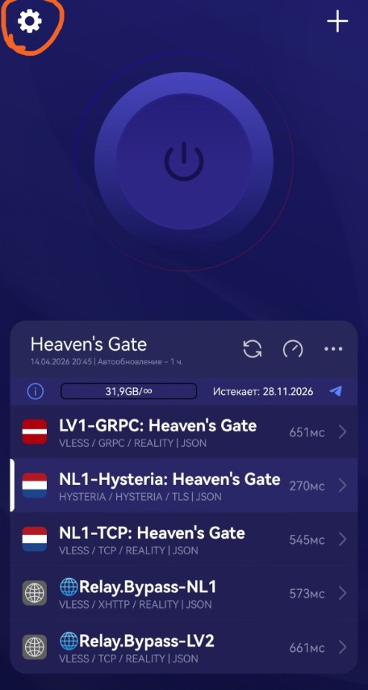
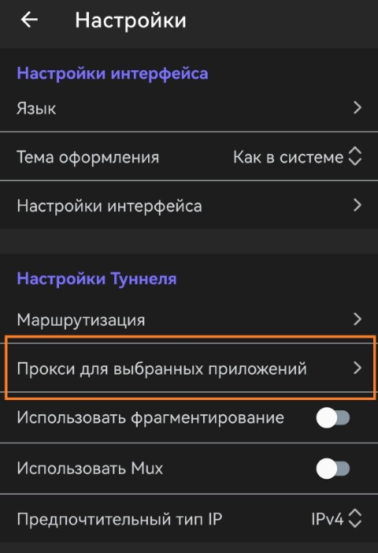
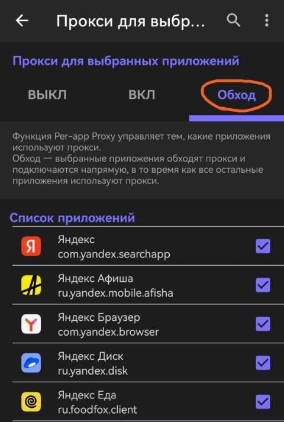
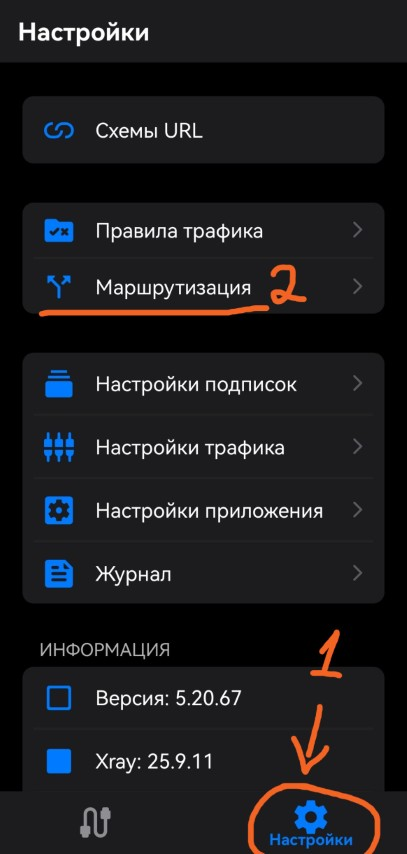
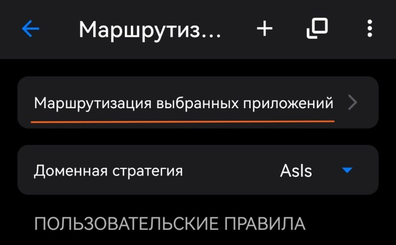
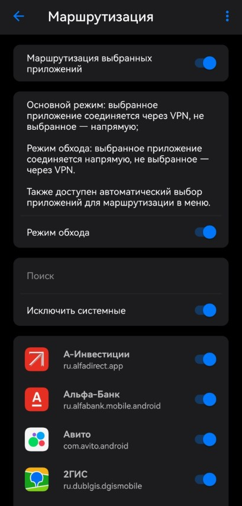

# О раздельном туннелировании

Раздельное туннелирование (Split Tunneling) -- это режим VPN, при котором только выбранные приложения или сайты идут через VPN, а остальной трафик выходит в интернет напрямую.

## Когда использовать

- Нужно, чтобы часть сервисов работала через VPN, а часть напрямую.
- Есть сайты, которые плохо работают из-под VPN (банки, госуслуги, маркетплейсы).
- Хочешь оставить VPN только для нужных приложений: Telegram, YouTube, Discord и т.д.

## Зачем использовать, и почему это важно

- Снижается нагрузка на сервер.
- Часто улучшается скорость и стабильность для приложений, которым VPN не нужен.
- Удобнее совмещать обычный интернет и VPN в одном устройстве, вообще не отключаясь. _Почти как в старые добрые_

И, самое главное: 
!!! info "Отдельные приложения по требованию Минцифры могут отслеживать наличие/отсутствие VPN трафика, из-за чего могут быть проблемы не только у нас, но и у тебя."
    В список таких приложений входят, например:

    - Национальный мессенджер **MAX**
    - Приложения Яндекса (ЯБраузер, Яндекс Go, Яндекс Музыка)
    - Маркетплейсы (Wildberries, Ozon)
        
    Учитывая крайне агрессивную политику РосКомНадзора по отношению к VPN, такая мера может скоро стать необходимостью.

## Как настроить

=== ":happ: Happ"

    1. Открой клиент Happ и зайди в настройки (шестерёнка в левом верхнем углу).

        

    2. Перейди в раздел `Прокси для выбранных приложений`.

        

    3. Выбери режим `Обход`.

        
    
    4. Добавь приложения в список (например, Госуслуги, Яндекс, и т.д.)
    
    5. Перезапусти подключение, если оно было активно.

    На этом настройка закончена. **Вы великолепны!**

=== ":v2ray: V2RayTun"
    1. Открой клиент V2RayTun и зайди в настройки.
    
    2. Найди раздел `Маршрутизация` (`Route`).
    
        
    
    3. Выбери пункт `Маршрутизация выбранных приложений`.
    
        
    
    4. Добавь приложения в список (например, Госуслуги, Яндекс, и т.д.)
        
        ??? note "Включи тумблер `Режим обхода`, чтобы трафик шёл напрямую только через выбранные приложения"
            Для удобства также нажми на `Исключить системные [приложения]`.
            
    
    5. Перезапусти подключение, если оно было активно.
    
    На этом настройка закончена. **Вы великолепны!**

!!! tip "После настройки"
    Проверь несколько сайтов и приложений: что-то должно идти через VPN, а что-то напрямую. Если поведение обратное, поменяй режим списка.

## А есть готовый список приложений?

!!! tip "Мы работаем над этим."
